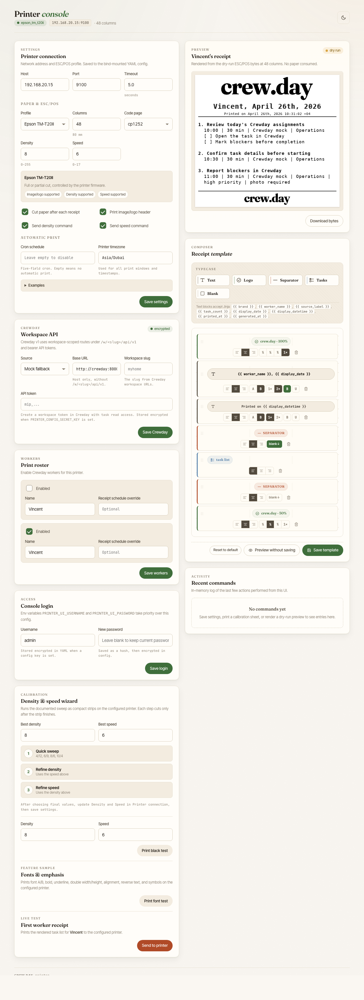
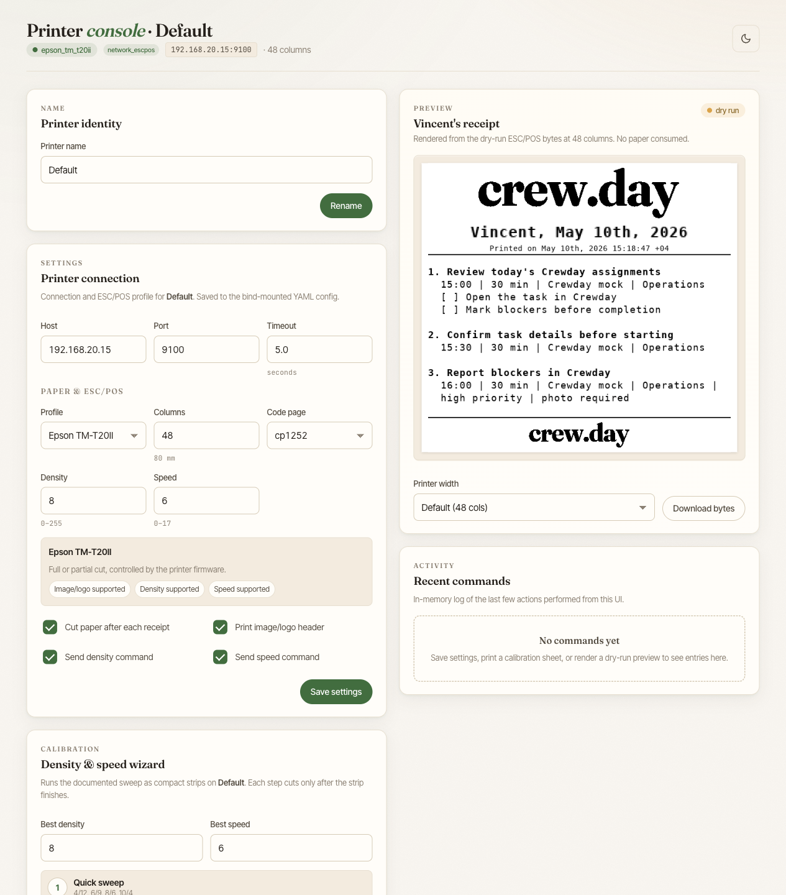

# Crewday Thermal Printer

| Console | Printer setup |
|---|---|
|  |  |

Crewday Thermal Printer is a Docker-hosted control panel for turning Crewday task lists into compact ESC/POS receipt prints. It keeps the boring parts explicit: where tasks come from, which workers print, when they print, how the receipt looks, and which printer backend receives the bytes.

It is built for thermal receipt printers such as the Epson TM-T20II, but printer details stay configurable. You can dry-run a receipt preview without touching hardware, then intentionally send a test page, calibration sheet, or scheduled worker batch to a real printer.

Pre-built images are published to [ghcr.io/crewday/printer](https://github.com/crewday/printer/pkgs/container/printer):

```sh
docker pull ghcr.io/crewday/printer:latest
```

## Quick Start

Start the local development UI with auto-reload:

```sh
docker compose up dev
```

Open <http://127.0.0.1:8087> and sign in with:

```text
Username: admin
Password: admin
```

The fixed `admin` / `admin` login comes from `docker-compose.override.yml` and is only for local development. The UI writes to the bind-mounted YAML config at `config/printer.yaml`.

For production-style runs with the pre-built image, use the base compose file and set a password before exposing the UI. Keep `PRINTER_CONFIG_SECRET_KEY` stable across container recreations if you store encrypted YAML secrets.

```sh
docker compose -f docker-compose.yml up -d printer
```

Set `PRINTER_UI_PASSWORD` and `PRINTER_CONFIG_SECRET_KEY` in the deployment environment or a local `.env` file before running that command.

```env
PRINTER_UI_PASSWORD=change-me
PRINTER_CONFIG_SECRET_KEY=replace-with-a-stable-random-secret
```

If neither `PRINTER_UI_PASSWORD` nor a YAML password hash is configured, the UI is intentionally unprotected. Do not expose that mode beyond a trusted local machine or network.

## First Setup Checklist

Use the UI for normal setup. Use the commands below when you want a repeatable terminal path.

1. Create or inspect the YAML config:

   ```sh
   docker compose run --rm printer uv run python -m printer_app init-config --config /config/printer.yaml
   ```

2. Pick a task source:

   `crewday_http` is the default source. Set `crewday.base_url` with `http://` or `https://`, `workspace_slug`, and `CREWDAY_API_TOKEN` or an encrypted YAML token through the UI. Workspace tokens and personal access tokens both use the same bearer-token setting; when a worker row has no Crewday user id, the printer asks Crewday for the token-visible task list without an assignee filter. Select the `mock` source, shown in the UI as Offline sample tasks, only when you need offline previews or printer setup without Crewday. Disable `crewday.verify_tls` only for self-hosted HTTPS endpoints with a certificate you intentionally do not want verified.

3. Find the printer connection:

   Network printers need an IP address and port, usually `9100` for raw ESC/POS. The default tested printer is an Epson TM-T20II at `192.168.20.15`, but that address is not assumed by the application.

   If you do not know the printer IP, ask the human operator first. They may know it from the printer self-test page, router/DHCP leases, a label, or the existing CUPS setup.

   For host CUPS discovery from the container, when `/var/run/cups/cups.sock` exists:

   ```sh
   docker compose run --rm \
     -v /var/run/cups/cups.sock:/var/run/cups/cups.sock \
     -e CUPS_SERVER=/var/run/cups/cups.sock \
     printer lpstat -v
   ```

   For USB or CUPS discovery in the app, start the UI, add or open a printer, and use the device dropdown. The UI calls Docker-contained discovery endpoints for USB devices and CUPS queues.

4. Render before printing:

   ```sh
   docker compose run --rm printer uv run python -m printer_app preview --config /config/printer.yaml
   docker compose run --rm printer uv run python -m printer_app print-test --dry-run --config /config/printer.yaml
   ```

5. Print intentionally:

   ```sh
   docker compose run --rm printer uv run python -m printer_app print-test --config /config/printer.yaml
   ```

6. Configure workers and schedules:

   The UI can enable workers, assign printers, and save global or per-worker five-field cron expressions. Empty cron values mean no automatic printing.

## Notes For Agents

All project runtime and toolchain commands must run inside Docker. Do not run Python, uv, tests, linters, app servers, calibration, printer commands, CUPS, or printer drivers directly on the host.

Normal repository inspection and editing can happen on the host. Examples: `rg`, `sed`, `git status`, `git diff`, and file edits.

When setup requires unknown physical details, ask the human. Good questions are:

- What is the printer IP address or CUPS queue name?
- Is the printer connected over network, USB, or CUPS?
- Which Crewday workspace and workers should print?
- What time zone and print schedule should be used?

Before asking, inspect what the repo or Docker-contained environment can reveal. Useful safe checks include reading `config/printer.yaml`, checking compose env, using the UI discovery dropdowns, or checking CUPS queues from a Docker container with the CUPS socket mounted.

Treat real paper output as an integration side effect. Prefer `preview` and `--dry-run` first, then make real printing explicit.

## What The App Does

The service has explicit boundaries for:

- Crewday HTTP or offline sample task data
- YAML-backed configuration
- Authenticated setup and calibration UI
- Receipt rendering and template composition
- Schedule matching
- Printer transport

Supported printer transports:

| Type | Config `type` | Connection |
|---|---|---|
| Network TCP | `network_escpos` | Raw socket to `host:port` |
| USB | `usb_escpos` | Direct USB via vendor/product ID |
| CUPS | `cups_escpos` | Raw ESC/POS through the CUPS `lp` command |

Printer profiles live in `src/printer_app/profiles/*.yaml`. A profile declares preset columns, cut behavior, supported code pages, image/logo support, and whether density/speed ESC/POS commands should be sent. Add another printer preset by dropping a YAML file in that folder.

## Commands

Build the development image:

```sh
docker compose build
```

Render a text preview:

```sh
docker compose run --rm printer uv run python -m printer_app preview --config /config/printer.yaml
```

Render ESC/POS bytes without printing:

```sh
docker compose run --rm printer uv run python -m printer_app print-test --dry-run --config /config/printer.yaml
```

Print to the configured printer:

```sh
docker compose run --rm printer uv run python -m printer_app print-test --config /config/printer.yaml
```

Calibrate printer darkness and speed:

```sh
docker compose run --rm printer uv run python -m printer_app black-test --density 8 --speed 6 --config /config/printer.yaml
```

Print a font/table test:

```sh
docker compose run --rm printer uv run python -m printer_app table-test --config /config/printer.yaml
```

See [docs/PRINTER_CALIBRATION.md](docs/PRINTER_CALIBRATION.md) for the full calibration procedure.

Run tests, linting, and formatting through uv inside Docker:

```sh
docker compose run --rm printer uv run --group dev pytest
docker compose run --rm printer uv run --group dev ruff check .
docker compose run --rm printer uv run --group dev ruff format .
```

## REST Printing

The REST endpoint prints all enabled workers by default:

```sh
curl -u admin:admin -X POST http://127.0.0.1:8087/api/receipts/print
```

Print selected workers:

```sh
curl -u admin:admin \
  -H 'Content-Type: application/json' \
  -d '{"workers":["Vincent"]}' \
  http://127.0.0.1:8087/api/receipts/print
```

The UI can also create scoped API tokens for print automation. Token auth uses:

```sh
curl -H "Authorization: Bearer cpt_..." \
  -X POST http://127.0.0.1:8087/api/receipts/print
```

## Receipt Templates

Receipts use a YAML `receipt_template` section. Existing configs without this section keep the built-in default layout: logo, worker/date heading, printed timestamp, separator, task list, separator, footer logo, and a final blank line.

Template text values use Jinja variables such as `brand`, `worker_name`, `display_date`, `display_datetime`, `source_label`, and `task_count`.

```yaml
receipt_template:
  sections:
    - type: text
      value: "{{ worker_name }} - {{ display_date }}"
      align: center
      font: b
      width: 2
      height: 2
      bold: true
    - type: separator
    - type: tasks
    - type: blank
```

Supported section types are `logo`, `text`, `separator`, `tasks`, and `blank`. The web UI's Composer pane can preview, reorder, and save receipt blocks back to YAML. The `tasks` section keeps the standard compact task rendering with metadata and checklist items.

## Printer Configuration

Each printer in `config/printer.yaml` has a `type` field that selects the transport backend. Common fields like `profile`, `paper_columns`, `code_page`, `print_density`, `print_speed`, and `cut` are shared across printer types.

### Network printer (`network_escpos`)

```yaml
printers:
  - name: Network
    type: network_escpos
    host: 192.168.20.15
    port: 9100
    timeout_seconds: 5
    profile: epson_tm_t20ii
    paper_columns: 48
    code_page: cp1252
    cut: true
```

Use the actual printer IP for `host`. If it is unknown, ask the human operator or check the printer self-test page, router/DHCP leases, or an existing CUPS queue.

### USB printer (`usb_escpos`)

```yaml
printers:
  - name: USB
    type: usb_escpos
    usb_vendor_id: 0x04b8
    usb_product_id: 0x0e15
    profile: epson_tm_t20ii
    paper_columns: 48
    code_page: cp1252
    cut: true
```

For Docker USB access, pass the USB bus to the service:

```yaml
services:
  printer:
    devices:
      - /dev/bus/usb:/dev/bus/usb
```

Prefer the UI's USB device dropdown for discovery. If manual discovery is needed, run it inside a Docker container with USB access rather than running printer tooling on the host.

### CUPS printer (`cups_escpos`)

```yaml
printers:
  - name: CUPS
    type: cups_escpos
    cups_printer_name: TM-T20II
    timeout_seconds: 10
    profile: epson_tm_t20ii
    paper_columns: 48
    code_page: cp1252
    cut: true
```

The printer must be configured as a raw queue in CUPS.

#### Option A: Use the host's CUPS daemon

Mount the CUPS socket and point the container client at it:

```sh
docker compose run --rm \
  -v /var/run/cups/cups.sock:/var/run/cups/cups.sock \
  -e CUPS_SERVER=/var/run/cups/cups.sock \
  printer lpstat -v
```

Then print through the configured queue:

```sh
docker compose run --rm \
  -v /var/run/cups/cups.sock:/var/run/cups/cups.sock \
  -e CUPS_SERVER=/var/run/cups/cups.sock \
  printer uv run python -m printer_app print-test --config /config/printer.yaml
```

#### Option B: Run CUPS inside the container

Set `CUPS_ENABLED=true` to start the CUPS daemon automatically on container startup. Use `CUPS_LPADMIN_*` variables to auto-configure a raw printer queue, or mount a custom `/etc/cups` for full control.

```sh
CUPS_ENABLED=true \
CUPS_LPADMIN_NAME=TM-T20II \
CUPS_LPADMIN_PRINTER="socket://192.168.20.15:9100" \
docker compose up dev
```

| Variable | Default | Purpose |
|---|---|---|
| `PRINTER_UI_USERNAME` | `admin` | UI username |
| `PRINTER_UI_PASSWORD` | empty | UI password; empty means auth depends on YAML password hash |
| `PRINTER_CONFIG_SECRET_KEY` | empty | Enables encryption for stored YAML secrets |
| `CUPS_ENABLED` | `false` | Start the CUPS daemon inside the container |
| `CUPS_LPADMIN_NAME` | empty | Queue name passed to `lpadmin -p` |
| `CUPS_LPADMIN_DESC` | empty | Queue description passed to `lpadmin -D` |
| `CUPS_LPADMIN_PRINTER` | empty | Device URI passed to `lpadmin -v`, such as `socket://host:port` or `usb://Vendor/Model` |
| `CUPS_SERVER` | empty | Override the CUPS server address for the `lp` / `lpstat` client commands |

To persist CUPS configuration across container restarts, mount a named volume at `/etc/cups`:

```yaml
volumes:
  - cups-config:/etc/cups
```

## Dependency Updates And Releases

Dependabot is configured in `.github/dependabot.yml` to open one grouped weekly PR for Python, Docker, and GitHub Actions dependency updates. Version update PRs use a 7-day cooldown, and uv is configured with `exclude-newer = "7 days"` so Docker builds avoid Python packages uploaded in the last week.

Create and publish a new image release with:

```sh
scripts/release.sh 0.2.0
```

The script updates `pyproject.toml`, creates an annotated `v0.2.0` tag, and pushes the commit and tag. The tag push triggers the Docker publish workflow, which publishes `ghcr.io/crewday/printer:0.2.0`, `:0.2`, `:0`, `:latest`, and a SHA tag.
